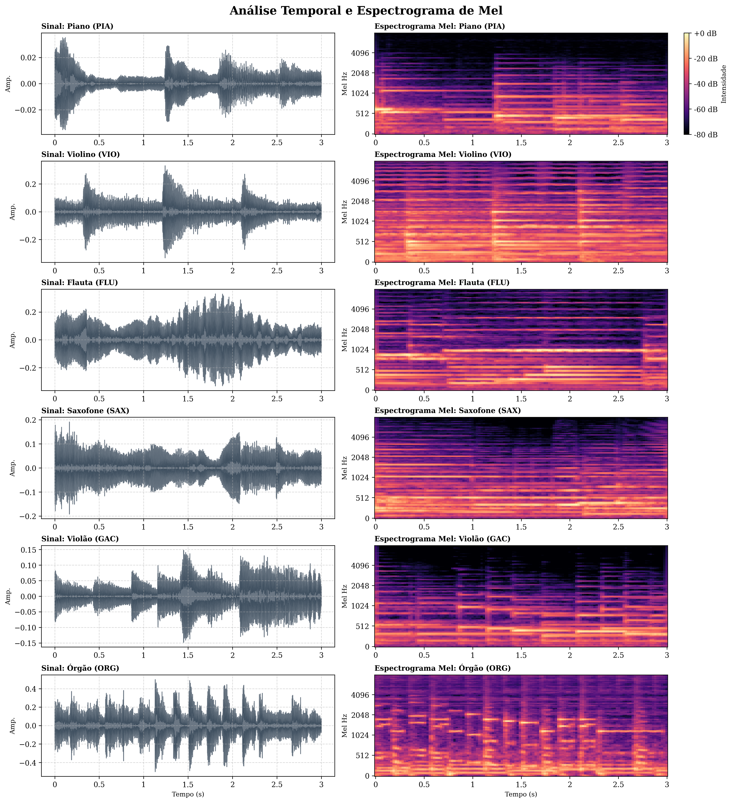
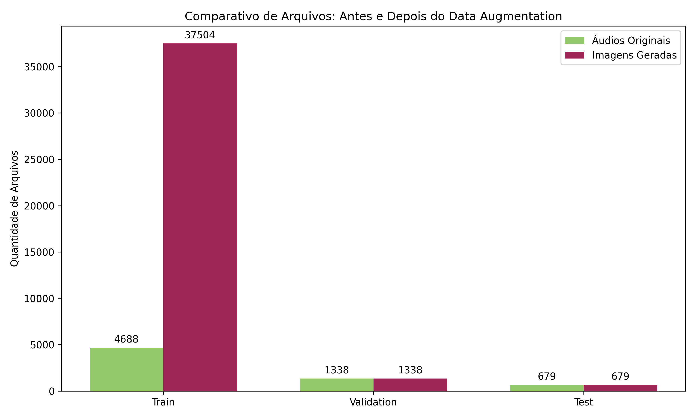
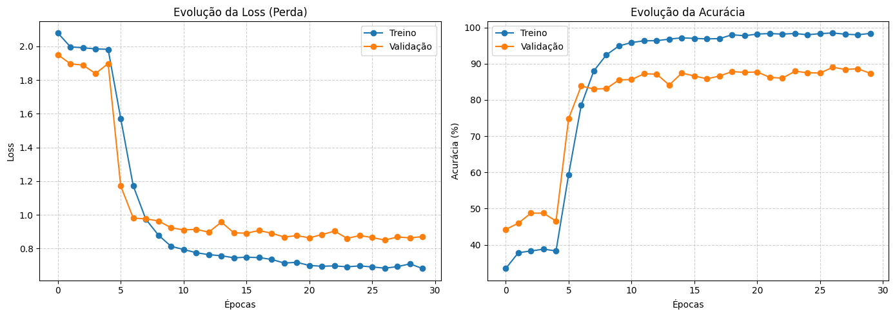
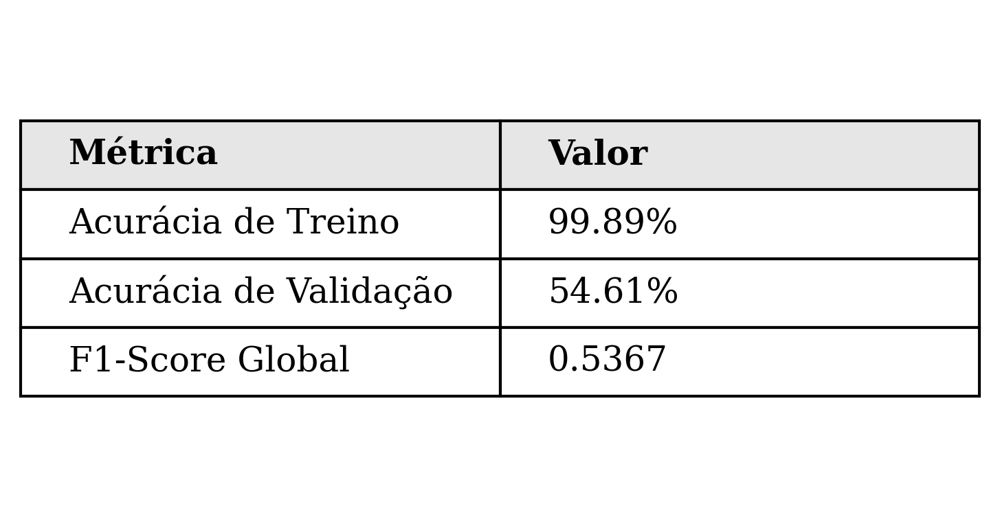
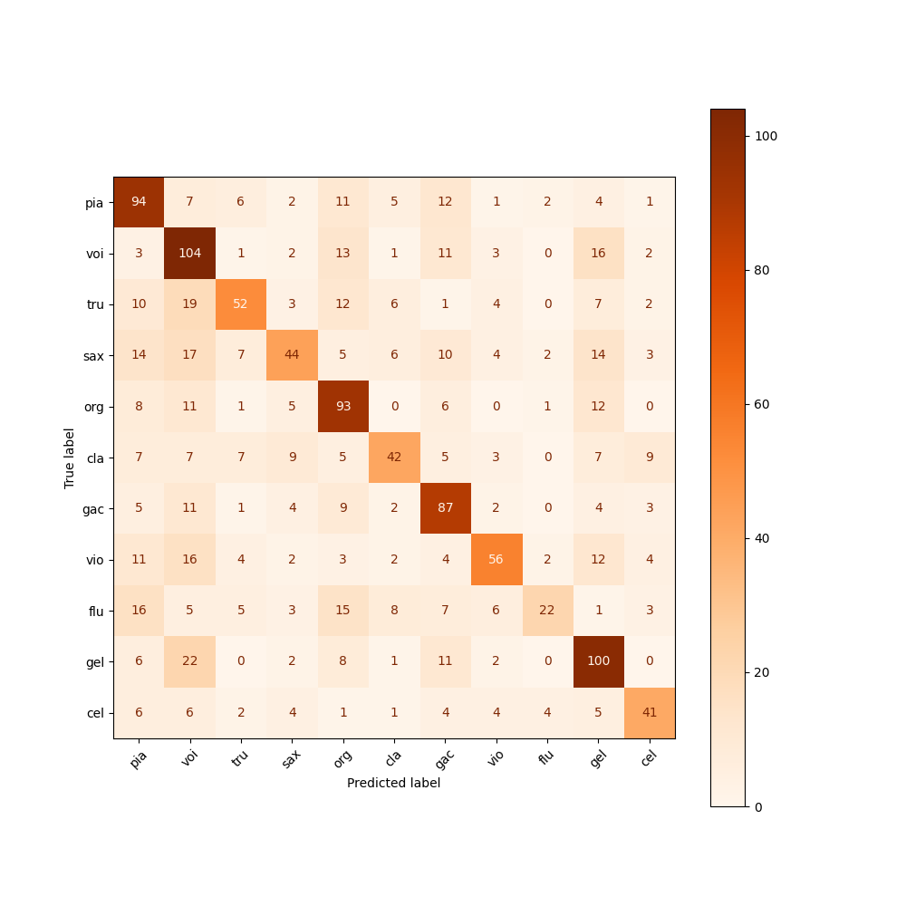
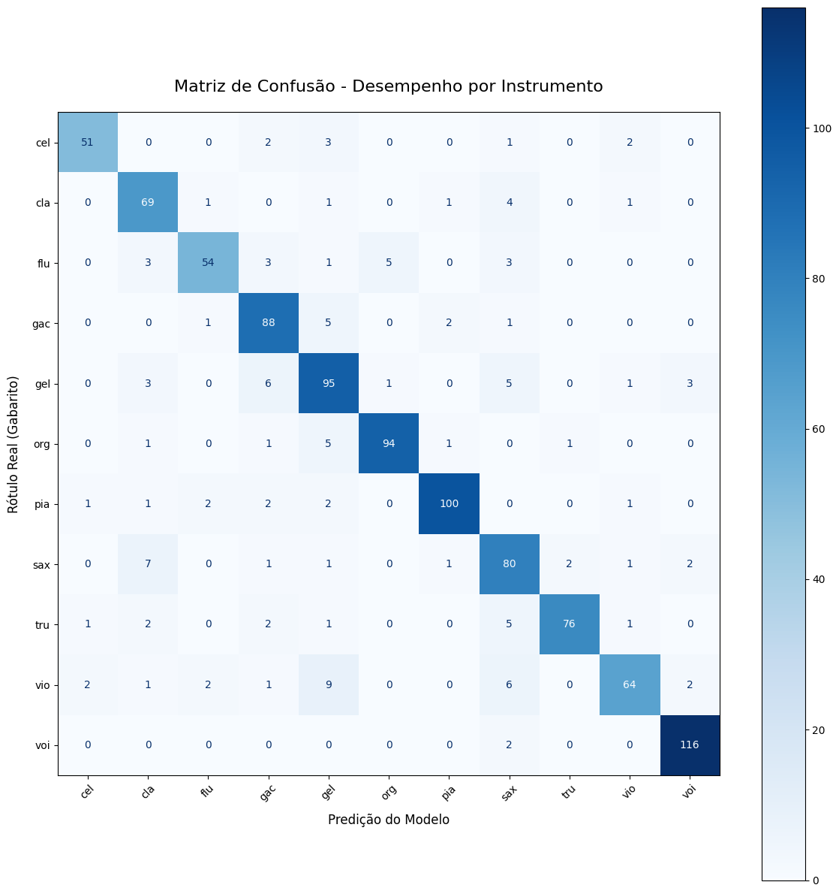

# Classificadores de Instrumentos Musicais: Do Baseline à Análise de Espectrograma via Deep Learning

[](https://www.python.org/)
[](https://pytorch.org/)
[](https://scikit-learn.org/)
[](https://librosa.org/)

Projeto desenvolvido para o processo seletivo do Ramo Estudantil _IEEE Control Systems Society (CSS)_ na Universidade de Brasília (UnB), focado na trilha de _Tech & Innovation_. 

Este repositório explora o reconhecimento e a classificação de instrumentos musicais utilizando processamento de sinais de áudio. O projeto é dividido em duas abordagens principais: um modelo de _Baseline (Random Forest)_ utilizando extração de características 1D, e um pipeline avançado de _Deep Learning (ResNet50)_ utilizando transferência de aprendizado sobre Mel-Espectrogramas 2D.

---

## O Dataset IRMAS

Os dados utilizados neste projeto provêm do [Dataset IRMAS (Instrument Recognition in Musical Audio Signals)](https://www.kaggle.com/datasets/urvishp80/irmas-training-data?resource=download). O conjunto disponiblizado publicamente inclui trechos curtos de áudio (3 segundos) cobrindo 11 classes de instrumentos:

*Violoncelo (cel), Clarinete (cla), Flauta (flu), Violão Acústico (gac), Guitarra Elétrica (gel), Órgão (org), Piano (pia), Saxofone (sax), Trompete (tru), Violino (vio) e Voz (voi).*

---

## Arquitetura do Projeto

### 1. Classificador Baseline (Machine Learning Clássico)
Para estabelecer um ponto de partida, desenvolvemos um modelo preditivo baseado em Extração de Características e Árvores de Decisão.
* **Feature Extraction:** Utilização do `librosa` para extrair 40 coeficientes Mel-Frequency Cepstral Coefficients (MFCCs). A média temporal desses coeficientes gera um vetor 1D por áudio.
* **Modelo:** Treinamento de um `RandomForestClassifier` com 100 estimadores.
* **Script:** Localizado em `Classificador_Baseline/baseline.py`, que realiza o treinamento, plota a matriz de confusão e possui uma interface via terminal (CLI) usando a biblioteca `rich` para inferência em tempo real.

### 2. Classificador via Pipeline de Deep Learning
A abordagem principal eleva a precisão transformando o problema de áudio em um problema de Visão Computacional.
* **Transformação de Domínio:** Conversão das formas de onda originais em Mel-Espectrogramas (imagens 2D).
* **Data Augmentation Estratégico:** Implementação de técnicas como *Pitch Shifting*, *Time Stretching*, e Injeção de Ruído para robustecer o modelo, multiplicando a base de dados de treino e equilibrando as classes.
* **Arquitetura da Rede:** *Fine-tuning* de uma rede **ResNet50** (pré-treinada na ImageNet), descongelando camadas convolucionais mais profundas (`layer3` e `layer4`) e substituindo a camada totalmente conectada (FC) com *Dropout* para mitigação de overfitting.
* **Otimização:** Uso de `AdamW` com _Weight Decay_ e agendamento de taxa de aprendizado (`ReduceLROnPlateau`).

---

## Análise e Resultados Visuais

### 1. Transformação de Sinal para Espectrograma
A conversão do áudio bruto em uma representação de tempo-frequência (Mel-Espectrograma) permite que a rede neural convolucional identifique padrões harmônicos e timbrais exclusivos de cada instrumento.



### 2. Distribuição e Aumento de Dados
Para evitar o sobreajuste (overfitting) e lidar com limitações na quantidade de dados, aplicamos augmentation massivo exclusivamente na base de treinamento, saltando de cerca de 4.600 áudios para mais de 37.000 amostras.



### 3. Desempenho do Treinamento - _ResNet50_
A evolução das funções de perda (_Loss_) e de acurácia demostram um aprendizado contínuo, com a rede estabilizando a validação de forma robusta graças ao *Label Smoothing* e às técnicas de máscara de tempo e frequência aplicadas nos Tensores.


### 4. Desempenho do Treinamento - _RandomForest_
a alta acurácia de treino e a mediana acurácia de válidação comprovam que o modelo sofreu _overfitting_. Ou seja, o modelo decorou os dados de treino, expondo sua incapacidade efetiva de generalizar os sinais de áudio e evidenciando a necessidade de aprendizado profundo para a classificação dos instrumentos. 



### 5. Matrizes de Confusão: Baseline vs. Deep Learning
O salto qualitativo entre as duas abordagens fica evidente na diagonal principal das matrizes. Enquanto o Baseline (Random Forest) possui dificuldade natural em separar timbres complexos, a ResNet50 atinge um poder de discriminação muito superior.

<div align="center">
  
  
</div>

---

## Estrutura do Repositório

```text
📦 ProjectCSS
 ┣ 📂 Classificador_Baseline
 ┃ ┗ 📜 baseline.py           # ML Tradicional: MFCC + Random Forest
 ┣ 📂 Classificador_Pipeline
 ┃ ┣ 📜 dataset.py            # Geração de Espectrogramas e Data Augmentation
 ┃ ┣ 📜 Model.py              # Treinamento da ResNet50 no PyTorch
 ┃ ┗ 📜 Classificate.py       # Script de inferência carregando os pesos (.pth)
 ┣ 📂 DataImages              # Imagens dos gráficos, métricas e espectrogramas gerados
 ┣ 📜 ArtigoCSS               # Artigo sobre o Trabalho
 ┗ 📜 README.md

```

## Como Executar o Projeto


Siga os passos abaixo sequencialmente no seu terminal. É recomendável ativar um ambiente virtual antes de instalar as dependências.

 1. Clone o repositório e acesse a pasta
```bash
git clone [https://github.com/arthuneas/ProjectCSS.git](https://github.com/arthuneas/ProjectCSS.git)
cd ProjectCSS
```

 2. Instale as dependências necessárias
```bash
pip install torch torchvision torchaudio librosa scikit-learn numpy pandas matplotlib rich tqdm pillow
```

 3. Gere o Dataset em Imagens (Nota: O script solicitará o diretório do dataset IRMAS original)
```bsh
python Classificador_Pipeline/dataset.py
```

 4. Treine o Modelo ResNet50
```bash
python Classificador_Pipeline/Model.py
```

 5. Teste os Modelos (Escolha qual inferência deseja rodar e descomente a linha)
- Para rodar o modelo Clássico:

```bash
python Classificador_Baseline/baseline.py
```
- Para rodar o modelo de Robusto:
```bash
python Classificador_Pipeline/Classificate.py
```
